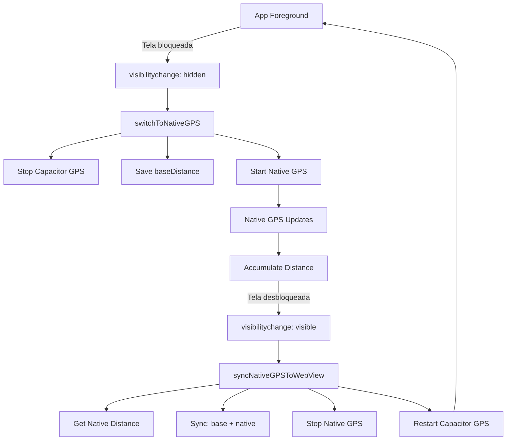

# 📱 Sistema Híbrido iOS - GPS e Áudio em Background

## 🎯 Objetivo

Corrigir definitivamente os problemas de:
1. **GPS que para de rastrear** quando a tela do iPhone está bloqueada
2. **Feedback de voz que não toca** com o app em background

## 🔧 Implementação

### Arquivos Criados

#### 1. **Plugin Nativo iOS - BioPeakLocationTracker** 
- `ios/App/App/BioPeakLocationTracker.swift` - GPS nativo usando CLLocationManager
- `ios/App/App/BioPeakLocationTrackerPlugin.m` - Bridge Objective-C
- `src/plugins/BioPeakLocationTracker.ts` - Interface TypeScript

**Funcionalidades:**
- `startLocationTracking()` - Inicia GPS nativo com `allowsBackgroundLocationUpdates`
- `stopLocationTracking()` - Para GPS nativo
- `getAccumulatedDistance()` - Retorna distância acumulada nativamente
- `resetDistance()` - Reseta contador de distância
- Event listener `locationUpdate` - Envia atualizações de GPS para JavaScript

#### 2. **Método Nativo de Áudio - BioPeakAudioSession**
- Adicionado `playAudioFile()` em `ios/App/App/BioPeakAudioSession.swift`
- Usa `AVAudioPlayer` nativo (funciona em background)
- Atualizada interface TypeScript em `src/plugins/BioPeakAudioSession.ts`

### Arquivos Modificados

#### 1. **useRealtimeSession.ts** - Sistema Híbrido GPS
**Novas refs:**
- `isInBackgroundRef` - Rastreia estado foreground/background
- `nativeGPSListenerRef` - Handle do listener nativo
- `baseDistanceBeforeBackgroundRef` - Distância base antes de ir para background

**Novas funções:**
- `switchToNativeGPS()` - Acionada quando app vai para background
  - Para GPS do WebView (Capacitor)
  - Salva distância atual como baseline
  - Inicia GPS nativo
  - Adiciona listener para atualizações nativas
  
- `syncNativeGPSToWebView()` - Acionada quando app volta ao foreground
  - Obtém distância do GPS nativo
  - Sincroniza com distância baseline
  - Para GPS nativo
  - Reinicia GPS do WebView

**Novo useEffect:**
- Detecta mudanças de visibilidade (`visibilitychange`)
- Aciona sistema híbrido automaticamente
- Funciona apenas em iOS nativo durante gravação

**Melhorias:**
- Salvamento de sessão aumentado de 10s → **3s**
- Logs detalhados de debug para rastreamento

#### 2. **useBackgroundCoach.ts** - TTS Nativo em Background
**Modificação em `playAudioFeedback()`:**
- Detecta se está em iOS background
- Usa `BioPeakAudioSession.playAudioFile()` ao invés de AudioContext
- Fallback para AudioContext quando em foreground
- Logs de debug aprimorados

#### 3. **ViewController.swift**
- Registrado novo plugin `BioPeakLocationTracker()`

#### 4. **debug.ts**
- Adicionado `debugGPSHybrid` com logs específicos para sistema híbrido

---

## 🧪 Como Testar

### Pré-requisitos
1. Fazer `git pull` do projeto
2. Executar `npm install`
3. Executar `npm run build`
4. Executar `npx cap sync ios`
5. Abrir projeto no Xcode
6. Conectar iPhone físico (GPS não funciona no simulador)

### Teste 1: GPS em Background (Tela Bloqueada)

**Objetivo:** Verificar se a distância continua acumulando com tela bloqueada

**Passos:**
1. Iniciar um treino no BioPeak
2. Andar ~50m com a tela **desbloqueada**
3. Verificar que a distância está aumentando normalmente
4. **Bloquear a tela do iPhone**
5. Andar mais ~100m com a tela bloqueada
6. **Desbloquear a tela**
7. ✅ **Esperado:** Distância total deve estar em ~150m

**Logs esperados no Safari Web Inspector:**
```
📱 [GPS HYBRID] App went to background - switching to native GPS
🔄 [GPS HYBRID] Switching to native GPS | Base distance: 50.0m
✅ [Native GPS] Started tracking
📍 [Native GPS] +5.2m → Total: 55.2m (accuracy: 8.5m)
📍 [Native GPS] +6.1m → Total: 61.3m (accuracy: 7.2m)
...
📱 [GPS HYBRID] App returned to foreground - syncing GPS
✅ [GPS HYBRID] Synced: 150.3m = 50.0m (base) + 100.3m (native)
✅ [GPS HYBRID] WebView GPS restarted
```

### Teste 2: Feedback de Voz em Background

**Objetivo:** Verificar se o feedback de voz toca com tela bloqueada

**Passos:**
1. Criar uma meta de 1km
2. Iniciar treino
3. Andar ~100m com tela desbloqueada
4. **Bloquear a tela**
5. Andar até completar 1km
6. ✅ **Esperado:** Ouvir feedback de voz mesmo com tela bloqueada

**Logs esperados:**
```
🎵 [AUDIO DEBUG] iOS em background - usando native audio player
🎵 [Native Audio] Downloading audio from: https://...
✅ [Native Audio] Playing audio in background
```

### Teste 3: Múltiplas Transições Background ↔ Foreground

**Objetivo:** Verificar estabilidade do sistema híbrido

**Passos:**
1. Iniciar treino
2. Andar 50m com tela desbloqueada
3. Bloquear tela → andar 50m
4. Desbloquear tela → andar 50m
5. Bloquear tela → andar 50m
6. Desbloquear tela → andar 50m
7. ✅ **Esperado:** Distância total ~250m sem saltos ou perdas

### Teste 4: Recuperação de Sessão

**Objetivo:** Verificar se sessão é recuperada após crash/kill do app

**Passos:**
1. Iniciar treino e andar 500m
2. Forçar fechamento do app (swipe up no multitasking)
3. Aguardar 1 minuto
4. Reabrir o app
5. ✅ **Esperado:** Dialog perguntando se deseja recuperar a sessão com 500m

---

## 📊 Diagnóstico de Problemas

### Se GPS não funcionar em background:

**1. Verificar logs no Safari Web Inspector:**
- Menu Safari → Develop → [Seu iPhone] → BioPeak-ai
- Procurar por erros com `[GPS HYBRID]`

**2. Verificar permissões no iPhone:**
- Ajustes → BioPeak → Localização → **"Sempre"**

**3. Verificar Info.plist:**
```xml
<key>UIBackgroundModes</key>
<array>
    <string>location</string>
    <string>audio</string>
</array>

<key>NSLocationAlwaysAndWhenInUseUsageDescription</key>
<string>BioPeak precisa acessar sua localização para rastrear seus treinos, mesmo em segundo plano.</string>
```

### Se áudio não funcionar em background:

**1. Verificar se AVAudioSession está ativa:**
- Procurar logs: `✅ AVAudioSession configured for background playback`

**2. Verificar se TTS está gerando áudio:**
- Logs devem mostrar: `🎵 [Native Audio] Downloading audio from...`

**3. Verificar volume do iPhone:**
- Aumentar volume físico do dispositivo
- Verificar se não está no modo silencioso

---

## 🔍 Arquitetura do Sistema Híbrido



### Fluxo de Dados:

**Foreground (WebView):**
- `Geolocation.watchPosition()` → JavaScript callback
- Acumula distância em `distanceAccumulatorRef`

**Background (Native):**
- `CLLocationManager` → Swift delegate
- Acumula distância nativamente
- Envia eventos para JavaScript

**Sincronização:**
- `totalDistance = baseDistance + nativeDistance`
- Mantém continuidade perfeita entre modos

---

## ✅ Checklist de Validação Final

Antes de considerar RESOLVIDO:

- [ ] **Teste 1 passou:** GPS continua acumulando com tela bloqueada
- [ ] **Teste 2 passou:** Feedback de voz toca em background
- [ ] **Teste 3 passou:** Múltiplas transições background/foreground funcionam
- [ ] **Teste 4 passou:** Sessão é recuperada após kill do app
- [ ] **Corrida real de 10km:** Registrou distância correta (não 400m!)
- [ ] **Logs limpos:** Sem erros no Safari Web Inspector
- [ ] **Experiência fluida:** Transições imperceptíveis para o usuário

---

## 📝 Notas Importantes

1. **Simulador iOS NÃO funciona** para testes de GPS - apenas dispositivo físico
2. **Web Inspector é essencial** para debug - habilitar no iPhone: Ajustes → Safari → Avançado → Web Inspector
3. **Permissão "Sempre"** é obrigatória - sem ela, GPS para em background
4. **Não funciona em modo de economia de energia** - iOS pode limitar GPS
5. **Primeira execução** pode levar ~30s para fixar sinal GPS inicial

---

## 🚀 Próximos Passos

Se os testes passarem:
1. ✅ Marcar issue como RESOLVIDO
2. 📊 Monitorar métricas de sessões em produção
3. 🔧 Considerar otimizações de bateria (ajustar `distanceFilter`)
4. 📱 Considerar implementação Android (já tem ForegroundService)

Se os testes falharem:
1. 📋 Capturar logs completos do Safari Web Inspector
2. 🔍 Verificar configurações do Info.plist
3. 📞 Reportar issue com logs e comportamento observado
